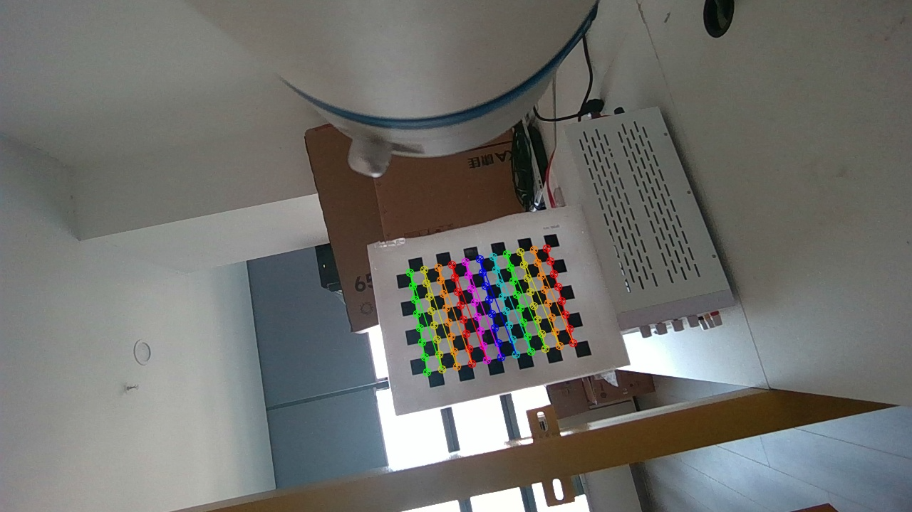
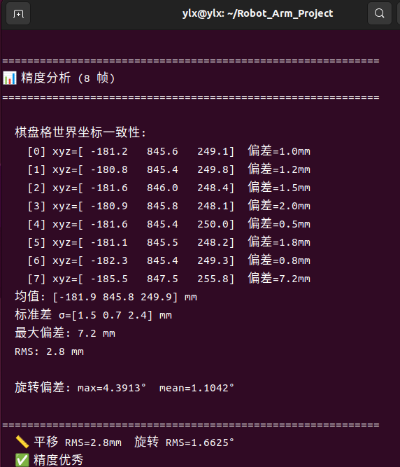
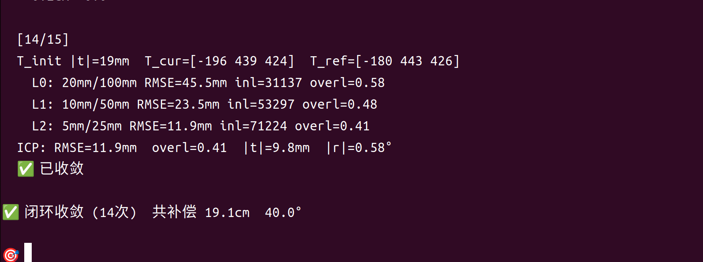

# CR5 手眼标定与 ICP 视觉伺服复现记录

本文档用于复现本项目的开发流程：D455 固定在 CR5 末端，先做 eye-in-hand 手眼标定，再用点云 ICP 估计当前视角到模板视角的偏差，最后通过机械臂关节运动闭环补偿。

## 1. 环境与硬件

硬件：
- DOBOT CR5 机械臂
- Intel RealSense D455 深度相机，安装在机械臂末端
- 棋盘格标定板：8 x 11 内角点，20 mm 方格

软件：
- ROS2 Humble
- DOBOT ROS2 驱动：`src/DOBOT_6Axis_ROS2_V4`
- RealSense ROS2 驱动：`src/realsense-ros`
- 项目核心包：`src/icp_servoing`

项目入口：
- 手眼标定：`scripts/handeye_chessboard.py`
- 标定验证：`scripts/verify_calib.py`
- ICP 伺服：`scripts/run_icp_servo.sh`
- 标定结果：`scripts/handeye_chessboard_result.json`

## 2. 启动顺序

终端 1，启动机械臂：

```bash
ros2 launch cr_robot_ros2 dobot_bringup_ros2.launch.py
```

终端 2，启动 D455 点云：

```bash
ros2 launch realsense2_camera rs_launch.py pointcloud.enable:=true
```

终端 3，启动 ICP 伺服程序：

```bash
cd ~/Robot_Arm_Project
source install/setup.bash
bash scripts/run_icp_servo.sh
```

程序启动后，命令行交互键位如下：

| 键 | 功能 |
| --- | --- |
| `r` | 录制模板点云，5 帧融合后建立 ICP 金字塔 |
| `1`-`6` | 按预设关节增量制造小/中/大扰动 |
| `m` | 执行一次 ICP 估计和补偿 |
| `a` | 闭环对齐，最多 15 次 |
| `H` | 记录当前关节角为 home |
| `h` | 回到 `scripts/home_pose.json` |
| `q` | 退出 |

## 3. 手眼标定

固定棋盘格，使相机在多个末端位姿下都能完整看到棋盘。执行：

```bash
python3 scripts/handeye_chessboard.py
```

采集逻辑：
- 机械臂自动移动到多个小幅扰动态，关节偏移约为 `±6°` 到 `±15°`
- 每帧通过 `solvePnP` 求 `T_camera_board`
- 过滤条件：角点完整、重投影误差小、距离在有效范围内
- 用 `AX=XB` 求解 `X = T_camera_in_tool`

本次结果：
- 有效帧数：10
- 运动对数：44
- 棋盘格重投影 RMSE：约 `0.37-0.42 px`
- 棋盘格距离：约 `645-717 mm`
- `T_camera_in_tool` 平移：`[8.17, 89.52, -300.96] mm`
- `T_camera_in_tool` 姿态：`[-2.05, -0.08, -12.23] deg`

标定过程截图：



## 4. 标定验证

执行：

```bash
python3 scripts/verify_calib.py
```

验证思路：将多帧棋盘格角点通过 `T_base_tool * T_camera_in_tool * T_camera_board` 统一变换到基座坐标系，检查同一个固定棋盘在世界坐标中的一致性。RMS 越小，手眼矩阵越可靠。

判据：
- `RMS < 3 mm`：可用于 ICP 伺服
- 若误差偏大，优先检查 ToolVectorActual 姿态约定、棋盘格尺寸、相机深度稳定性

误差验证图：



## 5. ICP 伺服流程

一次完整实验：

```text
启动机械臂和相机
  -> 启动 scripts/run_icp_servo.sh
  -> 按 r 录制模板
  -> 按 1-6 人为扰动机械臂
  -> 按 m 做单步补偿，或按 a 做闭环对齐
```

闭环截图：



核心链路：

```text
当前点云 + 模板点云
  -> 金字塔 ICP 得到 T_icp，单位 m
  -> 平移换算为 mm
  -> T_delta = X * T_icp * X^-1
  -> T_correction = T_delta^-1
  -> 提取平移和旋转，按比例补偿
  -> 雅可比伪逆求关节增量
  -> JointMovJ 执行
```

当前代码采用 `JointMovJ`，没有使用 `MovL`。原因是 CR5 的 `MovL` 固件兼容性不稳定，关节移动更可靠。

## 6. ICP 金字塔实现

录制模板时只做一次预处理：

```text
5 帧点云融合
  -> 5 mm 体素压缩
  -> 建立 3 层模板金字塔
```

| 层级 | 体素 | 最近邻阈值 |
| --- | --- | --- |
| L0 | 20 mm | 100 mm |
| L1 | 10 mm | 50 mm |
| L2 | 5 mm | 25 mm |

每层都预建 `cKDTree`。每次补偿时，只对当前点云按相同体素降采样，然后用已有 KDTree 查询最近邻，不重复建树。该优化把单次 ICP 从约 25 s 降到约 0.5 s 量级。

## 7. 控制参数

关键参数以当前代码 `src/icp_servoing/servoing.py` 为准：

| 项目 | 数值 |
| --- | --- |
| 模板录制帧数 | 5 |
| 收敛判据 | `|t| < 10 mm` 且 `|r| < 1°` |
| 最大闭环次数 | 15 |
| 单步平移限幅 | `30 mm` |
| 补偿比例 | 第 1-2 步 `70%`，第 3-5 步 `50%`，第 6 步后 `20%` |
| ICP RMSE 门控 | `< 60 mm` |
| ICP inliers 门控 | `>= 500` |
| ICP 平移门控 | `< 500 mm` |
| ICP 旋转门控 | `< 60°` |
| 机械臂速度 | `15%` |
| 碰撞等级 | `5` |

CR5 初始化顺序：

```text
ClearError -> DisableRobot -> EnableRobot -> SpeedFactor -> SetCollisionLevel(5)
```

不要额外调用 `PowerOn`。该调用在本项目设备上会导致异常下电或状态不一致。

## 8. 坐标与单位约定

必须保持以下约定一致，否则补偿方向会反：

| 项目 | 约定 |
| --- | --- |
| 手眼矩阵 | `X = T_camera_in_tool` |
| 机器人位姿 | `G = T_base_tool`，来自 `ToolVectorActual` |
| ToolVectorActual RPY | `Rot.from_euler('xyz', [rx, ry, rz], degrees=True)` |
| AX=XB | `A = G_j^-1 * G_i`，`B = C_j * C_i^-1` |
| ICP 内部单位 | 米 |
| 机械臂链路单位 | 毫米 |
| ICP 初值 | `T_init[:3,3]` 需要从 mm 除以 1000 |

补偿方向：

```text
T_icp 表示 current -> template
T_delta = X * T_icp * X^-1
T_correction = inverse(T_delta)
T_target = T_cur * partial(T_correction)
```

## 9. 复现实验检查表

运行前检查：
- `/camera/camera/depth/color/points` 有点云
- `/dobot_msgs_v4/msg/ToolVectorActual` 有有效 TCP 位姿
- `scripts/handeye_chessboard_result.json` 存在
- 机械臂附近无障碍物，碰撞等级为 5

标定检查：
- 棋盘格角点完整
- 重投影误差约小于 `0.5 px`
- `verify_calib.py` 输出 RMS 小于 `3 mm`

ICP 检查：
- 按 `r` 后能看到三层金字塔点数输出
- 按 `m` 后每层输出 RMSE、inliers、overlap
- 若质量门控通过，程序输出补偿比例、笛卡尔增量和关节增量
- 按 `a` 后在 15 次内达到 `|t| < 10 mm` 且 `|r| < 1°`

## 10. 常见问题

点云收不到：
- 确认相机启动命令包含 `pointcloud.enable:=true`
- 确认订阅话题为 `/camera/camera/depth/color/points`

补偿方向反了：
- 优先检查 `X = T_camera_in_tool` 是否被误写成 `T_tool_in_camera`
- 检查 ICP 输出是否按 `current -> template` 使用
- 检查 `T_correction = inverse(T_delta)` 是否遗漏

ICP 匹配点不足：
- 模板录制时视野内应包含稳定几何结构
- 扰动不宜过大，先用 `1` 或 `4` 小扰动验证
- 检查深度图是否有大面积空洞

机械臂移动失败：
- 程序会执行 `recover()`：`ClearError -> DisableRobot -> EnableRobot -> SpeedFactor -> SetCollisionLevel`
- 若仍失败，检查 CR5 控制柜状态、急停、碰撞状态和网络连接
- 节点数据不正常需重启驱动(例如:-40001,ToolVectorActual中xyz全0)

## 11. 下一步：夹爪 TCP 标定

后续会在末端安装夹爪。安装后，当前 `tool=0` 的默认 TCP 不再等于实际夹爪工作点，需要重新标定夹爪 TCP，再继续做抓取或视觉伺服。

目标：
- 得到 `T_flange_tcp_gripper`，即法兰/默认工具坐标系到夹爪实际工作点的位姿
- 将新的 TCP 写入机器人控制器或在代码中作为工具偏置使用
- 验证夹爪尖端在多姿态下指向同一个空间点，误差控制在毫米级

建议方案：固定尖点法。

```text
固定一个尖点或小球作为空间参考
  -> 用夹爪尖端轻触同一参考点
  -> 采集 6-10 个不同姿态的 ToolVectorActual
  -> 求解 TCP 相对法兰/默认工具坐标系的平移偏置
  -> 写入工具坐标或保存为 gripper_tcp.json
  -> 多姿态回点验证
```

采集要求：
- 每次夹爪尖端接触同一个固定点，位置不变，只改变末端姿态
- 姿态覆盖俯仰、偏航、滚转的小范围变化，避免姿态过于相似
- 接触时低速移动，避免夹爪或参考点受力变形
- 记录每帧 `ToolVectorActual` 和关节角，保留原始数据便于复算

计算方式：

```text
已知每次采集的 T_base_tool_i
未知 TCP 偏置 p_tool_tcp
同一个尖点在基座下坐标 p_base_fixed 不变

p_base_fixed = R_base_tool_i * p_tool_tcp + t_base_tool_i

多帧联立最小二乘，求 p_tool_tcp 和 p_base_fixed
```

验收标准：
- 用求出的 TCP 回算固定尖点坐标，各帧 RMS 小于 `2-3 mm`
- 在机器人控制器中启用新 TCP 后，绕 TCP 改变姿态时夹爪尖端应基本不漂移
- 若误差偏大，重新检查夹爪安装刚性、接触点一致性和 ToolVectorActual 稳定性

计划新增脚本：
- `scripts/calibrate_gripper_tcp.py`：采集多姿态数据并求解 TCP
- `scripts/verify_gripper_tcp.py`：读取标定结果，输出固定点 RMS
- `scripts/gripper_tcp.json`：保存夹爪 TCP 平移和可选姿态偏置
