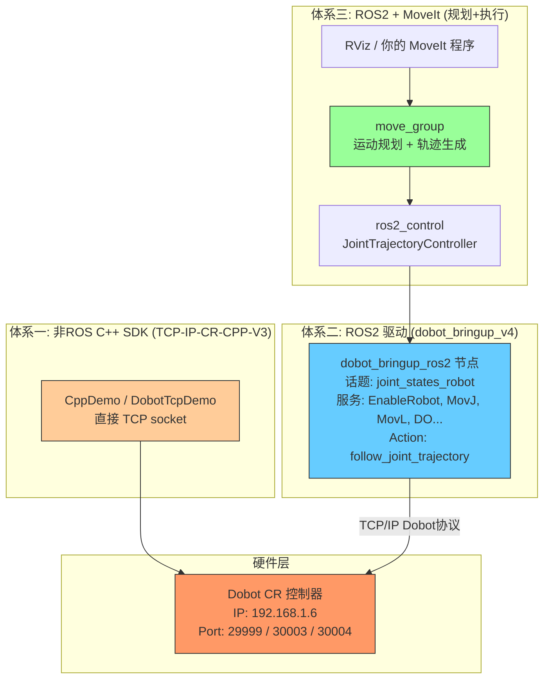

# CR5 ROS2 驱动架构与开发总结

## 1. 核心问题回答

### Q1: `cr5_moveit` 是 ROS2 驱动吗？

**不是。** `cr5_moveit` 是一个 **MoveIt 运动规划配置包**，不是驱动本身。

它包含的是：
- 机器人的 URDF/SRDF 模型描述
- MoveIt 运动规划参数（运动学求解器、关节限制等）
- Launch 启动文件（move_group、RViz、Gazebo 等）
- ros2_control 控制器配置文件

**真正的 ROS2 驱动是 `dobot_bringup_v4`**（内部包名 `cr_robot_ros2`），它负责通过 TCP/IP 与机械臂控制器通信，并将机器人的能力暴露为 ROS2 接口（服务、话题、Action）。

### Q2: 用了 MoveIt 还需要 CppDemo 吗？

**不需要。** `/home/ylx/TCP-IP-CR-CPP-V3/CppDemo/` 是独立于 ROS2 的 C++ TCP/IP SDK 示例，它直接用 socket 向控制器发文本指令。这是另一套体系，两种方案二选一即可。

### Q3: 三套控制体系的关系是什么？

| 体系 | 路径 | 特点 |
|------|------|------|
| **CppDemo (非ROS)** | `/home/ylx/TCP-IP-CR-CPP-V3/CppDemo/` | 直接 TCP socket，发原始 Dobot 文本协议，无 ROS 依赖 |
| **ROS2 驱动** | `dobot_bringup_v4/` | ROS2 封装，内部也用 TCP 连控制器，对外暴露 ROS2 服务/话题 |
| **ROS2 + MoveIt** | `dobot_bringup_v4` + `cr5_moveit/` | 在 ROS2 驱动基础上加了运动规划（OMPL/Pilz 等规划器）和轨迹执行 |



## 2. 架构分层

### 2.1 dobot_bringup_v4 — ROS2 驱动层

这是真正的驱动，负责将机械臂能力映射为 ROS2 接口：

```
dobot_bringup_v4/
├── src/
│   ├── main.cpp           # 节点入口：发布 joint_states + 机器人状态
│   ├── cr_robot_ros2.cpp  # 核心：注册所有 ROS2 服务，内部调用 TCP socket
│   ├── command.cpp         # 指令编码：将函数调用转为 Dobot 协议字符串
│   ├── tcp_socket.cpp      # TCP 底层：connect / send / recv / select
│   └── parseTool.cpp       # 反馈数据解析
├── include/
│   └── dobot_bringup/      # 头文件
├── launch/
│   └── dobot_bringup_ros2.launch.py
└── config/
```

**对外提供的 ROS2 接口：**

| 类型 | 名称 | 用途 |
|------|------|------|
| **话题** | `joint_states_robot` | 发布实际关节角度（6轴） |
| **话题** | `dobot_msgs_v4/msg/RobotStatus` | 使能/连接状态 |
| **话题** | `dobot_msgs_v4/msg/ToolVectorActual` | 实际 TCP 笛卡尔位姿 |
| **服务** | `EnableRobot` | 使能机器人 |
| **服务** | `MovJ` / `MovL` | 点到点 / 直线运动 |
| **服务** | `SpeedFactor` | 速度百分比 |
| **服务** | `DO` / `DOInstant` | 数字输出 |
| **服务** | `GetAngle` / `GetPose` | 获取当前关节角/位姿 |
| **服务** | `ClearError`, `DisableRobot`, `EmergencyStop` ... | 控制类指令 |
| **Action** | `/<robot_type>_robot/joint_controller/follow_joint_trajectory` | 接收 MoveIt 规划的轨迹并执行 |

**关键参数（launch 中配置）：**
- `robot_ip_address`: 机器人 IP（默认 `192.168.1.6`）
- `robot_type`: 机器人型号（`cr5`, `cr10`, `cr16` 等）
- `trajectory_duration`: 轨迹执行时长

### 2.2 cr5_moveit — MoveIt 运动规划层

这是一个纯配置包，**不包含任何 C++/Python 源码**：

```
cr5_moveit/
├── CMakeLists.txt          # 仅 install 配置文件
├── package.xml             # 依赖 moveit_ros_move_group 等
├── .setup_assistant        # MoveIt Setup Assistant 元数据
├── config/
│   ├── cr5_robot.urdf.xacro                # 机器人 URDF 模型
│   ├── cr5_robot.srdf                      # 语义描述（运动组、碰撞矩阵等）
│   ├── cr5_robot.ros2_control.xacro        # ros2_control 配置
│   ├── kinematics.yaml                     # 运动学求解器配置
│   ├── joint_limits.yaml                   # 关节限制
│   ├── moveit_controllers.yaml             # 控制器映射
│   ├── ros2_controllers.yaml               # ros2_control JointTrajectoryController 定义
│   ├── pilz_cartesian_limits.yaml          # Pilz 规划器笛卡尔限制
│   └── moveit.rviz                         # RViz 界面配置
└── launch/
    ├── demo.launch.py                      # MoveIt 自带 Demo（交互式标记点拖拽）
    ├── dobot_moveit.launch.py              # 完整启动：rsp + move_group + rviz
    ├── move_group.launch.py                # 启动 move_group 节点
    ├── moveit_rviz.launch.py               # 启动 RViz + MoveIt 插件
    ├── rsp.launch.py                       # 启动 robot_state_publisher
    ├── moveit_gazebo.launch.py             # Gazebo 仿真启动
    ├── spawn_controllers.launch.py         # 启动 ros2_control 控制器
    └── static_virtual_joint_tfs.launch.py  # 静态 TF（虚拟关节）
```

### 2.3 dobot_demo — ROS2 调用示例

`dobot_demo/dobot_demo/demo.py` 是一个极简的 ROS2 客户端，展示了**不通过 MoveIt 直接调用驱动服务**的方式：

```python
# 直接调用 dobot_bringup_v4 的 ROS2 服务
self.EnableRobot_l = self.create_client(EnableRobot, '/dobot_bringup_ros2/srv/EnableRobot')
self.MovJ_l = self.create_client(MovJ, '/dobot_bringup_ros2/srv/MovJ')
self.MovL_l = self.create_client(MovL, '/dobot_bringup_ros2/srv/MovL')

# 发点位（关节角度/笛卡尔坐标）
node.point("MovJ", 50, -8, 0, 0, 0, 0)  # 关节运动
node.point("MovL", 100, 20, 50, 0, 0, 0) # 直线运动
```

## 3. 三种开发方式对比

### 方式一：纯 TCP 直连（CppDemo 体系）

```cpp
// 直接 socket，无 ROS 依赖
Dobot::CDashboard dashboard;
dashboard.Connect("192.168.1.6", 29999);
dashboard.EnableRobot();

Dobot::CDobotMove move;
move.Connect("192.168.1.6", 30003);
move.MovL(point);   // 发 "MovL(x,y,z,rx,ry,rz)"
move.Sync();         // 等队列完成
```

**优点：** 无 ROS 依赖，部署简单，直接对接协议  
**缺点：** 无规划能力，全靠自己算点位；无碰撞检测；无仿真

### 方式二：ROS2 驱动（dobot_bringup_v4 服务调用）

```python
# ROS2 节点，调用 dobot_bringup_v4 服务
node = Node("my_app")
cli = node.create_client(MovJ, '/dobot_bringup_ros2/srv/MovJ')
req = MovJ.Request()
req.a, req.b, req.c, req.d, req.e, req.f = (50, -8, 0, 0, 0, 0)
cli.call_async(req)
```

**优点：** ROS2 生态集成，有消息发布/订阅，可加入其他 ROS 节点  
**缺点：** 轨迹规划仍需要自己写，无碰撞检测

### 方式三：ROS2 + MoveIt（运动规划）

```python
# 通过 MoveIt Python API 做规划+执行
from moveit_configs_utils import MoveItConfigsBuilder
from moveit.planning import MoveItPy

moveit = MoveItPy(config_file=...)
moveit.move_to_pose(target_pose)  # 自动规划+碰撞检测+执行
```

**优点：** 自动轨迹规划、碰撞检测、运动学求解、仿真、可视化  
**缺点：** 系统复杂度最高，依赖 MoveIt 库

## 4. 推荐选型

| 场景 | 推荐方案 |
|------|----------|
| 简单点位搬运，无需碰撞检测 | 方式一（TCP 直连）或方式二（ROS2 服务调用） |
| 需要 ROS2 生态集成（与相机、传感器等联动） | 方式二（ROS2 驱动） |
| 复杂路径规划、多障碍物避让、仿真验证 | 方式三（ROS2 + MoveIt） |
| 仅需仿真/可视化，不需要真机 | 方式三（MoveIt + RViz / Gazebo） |

## 5. ROS2 工作空间启动流程

### 5.1 编译

```bash
cd /home/ylx/DOBOT_6Axis_ROS2_V4
colcon build --symlink-install
source install/setup.bash
```

### 5.2 仅启动驱动（无 MoveIt）

```bash
# 启动 dobot_bringup_v4，连接真机
ros2 launch dobot_bringup_v4 dobot_bringup_ros2.launch.py \
    robot_ip_address:=192.168.1.6 \
    robot_type:=cr5
```

然后可以用 `dobot_demo` 或自己的 ROS2 节点调用服务。

### 5.3 启动 MoveIt（仿真/真机）

```bash
# 启动 MoveIt + RViz（需要先启动驱动或 Gazebo）
ros2 launch cr5_moveit dobot_moveit.launch.py
```

### 5.4 启动 MoveIt Demo（交互式标记点）

```bash
ros2 launch cr5_moveit demo.launch.py
```

## 6. 关键文件速查

| 文件 | 作用 |
|------|------|
| `dobot_bringup_v4/src/main.cpp` | 驱动主节点：循环发布 joint_states |
| `dobot_bringup_v4/src/cr_robot_ros2.cpp` | 所有 ROS2 服务注册 + TCP 命令发送 |
| `dobot_bringup_v4/src/tcp_socket.cpp` | TCP 底层通信 |
| `cr5_moveit/config/cr5_robot.urdf.xacro` | 机器人 URDF 模型 |
| `cr5_moveit/config/ros2_controllers.yaml` | ros2_control 控制器定义 |
| `cr5_moveit/launch/dobot_moveit.launch.py` | MoveIt 完整启动文件 |
| `cr5_moveit/launch/demo.launch.py` | MoveIt 交互式 Demo 启动 |
| `dobot_demo/dobot_demo/demo.py` | ROS2 服务调用示例（无 MoveIt） |
| `TCP-IP-CR-CPP-V3/CppDemo/DobotTcpDemo.cpp` | 非 ROS TCP 直连示例 |

## 7. 数据流总结

```
机械臂控制器 (192.168.1.6:29999/30003/30004)
        ↕ TCP/IP (Dobot 协议)
    dobot_bringup_v4 (cr_robot_ros2 节点)
        ├── 话题: joint_states_robot ────→ robot_state_publisher ──→ TF
        ├── 话题: RobotStatus ──────────→ 状态监控
        ├── 服务: MovJ/MovL/DO... ←───── 外部 ROS2 节点直接调用
        └── Action: follow_joint_trajectory ←── ros2_control/JointTrajectoryController
                                                        ↕
                                                  move_group (MoveIt)
                                                        ↕
                                            RViz / 自定义 MoveIt 应用
```
